# Neo Fade UI

[](https://pub.dev/packages/neo_fade_ui)

A modern Flutter UI component library featuring glass morphism, gradient effects, and customizable themes.

[**Live Demo**](https://bassiuz.github.io/neo-fade-ui/)

## Installation

Add to your `pubspec.yaml`:

```yaml
dependencies:
  neo_fade_ui: ^0.0.1
```

Then run:

```bash
flutter pub get
```

## Usage

```dart
import 'package:neo_fade_ui/neo_fade_ui.dart';

NeoFadeTheme(
  data: NeoFadeThemeData.fromColors(
    primary: Color(0xFF6366F1),
    secondary: Color(0xFFF472B6),
    brightness: Brightness.dark,
  ),
  child: Scaffold(
    body: NeoButtonFilled(
      label: 'Hello Neo Fade',
      onPressed: () {},
    ),
  ),
)
```

## Component Showcase

All components support light and dark themes out of the box. Images below are from golden tests.

### Buttons

| Default | Dark | With Icon | Disabled |
|---------|------|-----------|----------|
|  |  |  |  |
|  |  |  |  |

### Chips

| Default | Selected | With Icon | Dark | Disabled |
|---------|----------|-----------|------|----------|
|  | 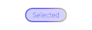 |  |  |  |

### Cards

| Default | Dark | Rich Content |
|---------|------|--------------|
| 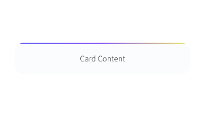 | 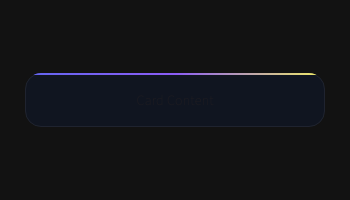 | 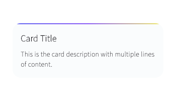 |

### Feature Cards

| Default | Dark | No Subtitle |
|---------|------|-------------|
| 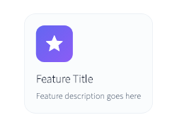 | 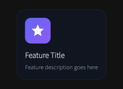 | 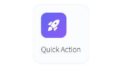 |

### List Tiles

| Default | Dark | Selected | Disabled | With Widgets |
|---------|------|----------|----------|--------------|
|  | 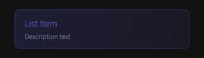 | 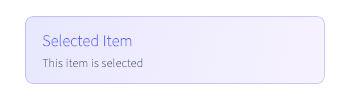 |  | 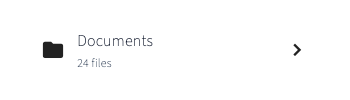 |

### Text Fields

| Default | Dark | With Label | Disabled |
|---------|------|------------|----------|
|  |  |  |  |
|  |  |  |  |

### Checkboxes

| Unchecked | Checked | Dark | With Label | Disabled |
|-----------|---------|------|------------|----------|
|  |  |  |  | 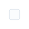 |

### Switches

| On | Off | Dark | Disabled |
|----|-----|------|----------|
|  |  |  |  |
| 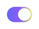 | 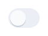 |  | 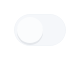 |

### Sliders

| Default | Dark | Min | Max |
|---------|------|-----|-----|
|  | 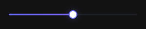 | 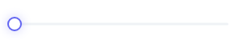 | 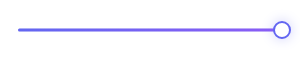 |

### Number Selector

| Default | Dark | Min | Max |
|---------|------|-----|-----|
| 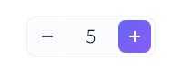 | 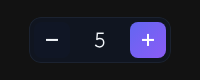 | 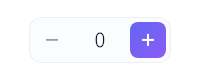 | 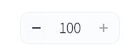 |

### Segmented Controls

| First | Middle | Last | Dark |
|-------|--------|------|------|
|  | 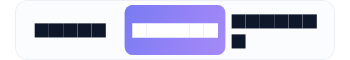 | 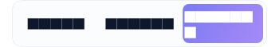 | 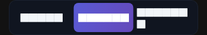 |
|  | 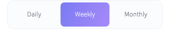 | 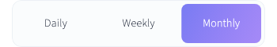 | 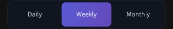 |
| 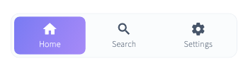 | 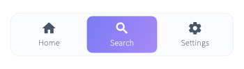 | | 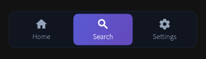 |

### Avatars

| Initials | Icon | Dark | No Ring |
|----------|------|------|---------|
|  |  | 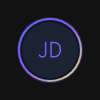 | 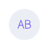 |

### Badges

| Dot | Count | Large Count | Dark | With Child |
|-----|-------|-------------|------|------------|
|  |  | 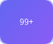 |  | 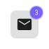 |

### Bottom Navigation

| First | Last | CTA | Dark |
|-------|------|-----|------|
| 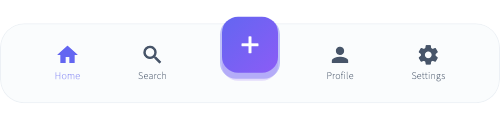 | 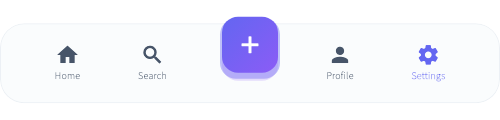 | 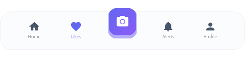 | 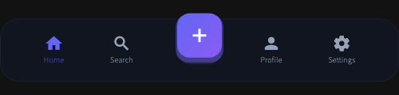 |

## Getting Started

This project uses [FVM](https://fvm.app/) to manage the Flutter SDK version.

```bash
# Install FVM if you haven't already
dart pub global activate fvm

# Install the project's Flutter version
fvm install

# Get dependencies
fvm flutter pub get

# Run the showcase app
fvm flutter run

# Run tests
fvm flutter test

# Update golden files
fvm flutter test --update-goldens
```
